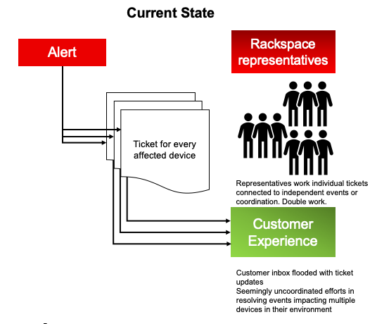
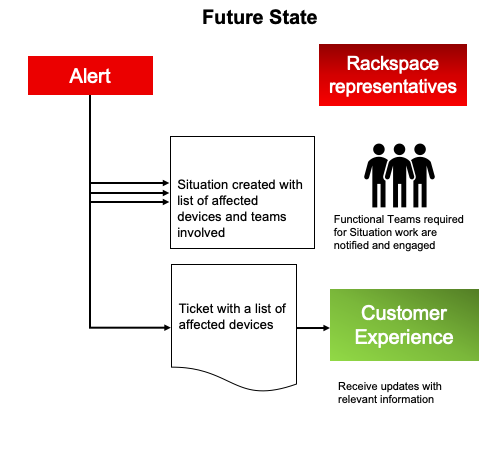
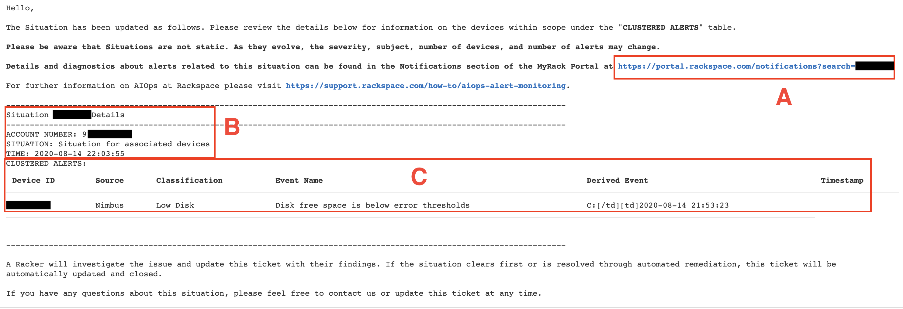
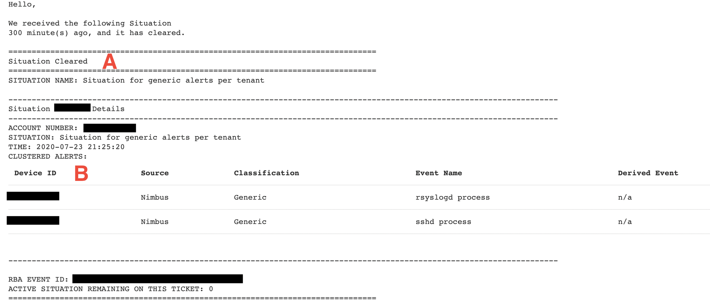
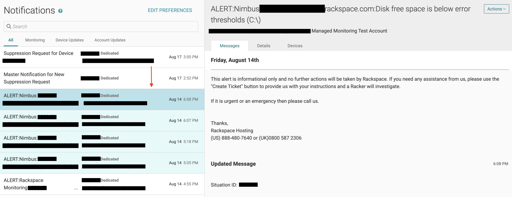
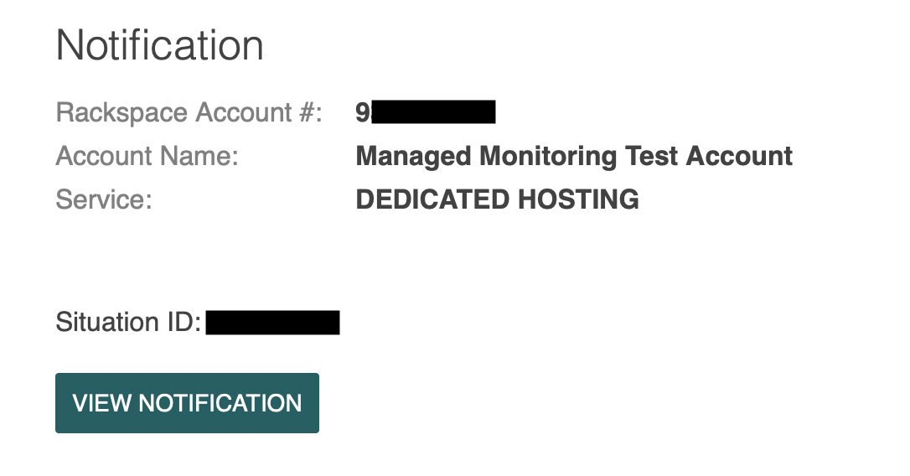

### About this guide

Rackspace Technology is deploying AIOps, a feature that applies artificial intelligence (AI) to your monitoring system. The AIOps feature changes the way in which you work with alerts. This guide provides existing customers with the following information:

- A description of what is changing, how the change impacts you, and the benefits you will receive
- An introduction to situations tickets and how to interpret them
- Instructions on how to view related alerts in Notifications
- Instructions on how to modify notification preferences to limit email notifications

**Intended audience:** This guide serves for existing Rackspace Technology customers who are familiar with how the current monitoring and alerting system works.  

### Overview of what's changing

The Rackspace Technology monitoring system collects events, in the form of raw data,from our monitoring systems and applies machine learning to deduplicate them into alerts. Rather than notifying you each time an alert occurs, AIOps analyzes and groups them together based on their similarity. These groups are known as **situations**.

Situation tickets offer the following benefits:

- By identifying situations, AIOps reduces noise and alert fatigue, granting you the ability to resolve the most critical issues to your system as they arise.
- Instead of different Rackspace Technology support representatives working to resolve multiple alerts, one Rackspace Technology support representative works on one, situational ticket.

Before AIOps, each alert generated a ticket, and then any related alerts also created tickets. The Rackspace Technology support team then worked individual tickets independently. This approach resulted in a flood of tickets and subsequent updates where many Rackspace Technology support representatives handled multiple alerts for the same issue.

For example, if a server goes down because it ran out of RAM, the monitoring system generated a **Memory Threshold Reached** alert and ticket. The server down scenario then generates an **Apache&reg; Service is down** alert and ticket. If the problem continues, the monitoring system also generated an **SSH alert** because the server cannot be reached. AIOps would gather these three alerts into a situation that could be worked by a single Rackspace Technology support representative.

The AIOps integration creates a situation (a collection of one or more alerts) and creates a single corresponding ticket referencing the situation. The system notifies and engages the support teams required to work the situation, and you receive updates from the single ticket.  

### About situation tickets

AIOps ingests the data collected by your monitoring systems, maps the event properties to the AIOps data fields, and identifies the source event as an AIOps event. Next, AIOps deduplicates the events into a single alert, which prevents duplicate alerts from being worked separately. Events are clustered into situations based on their similarities by using algorithms with machine learning capability. AIOps clusters alerts in a variety of ways, including the following methods:

- by their arrival time
- by the time, text string or description
- by using a deterministic logic set up by your administrator to clustr alerts in a specific way

AIOps also correlates the situation information with the information from other systems. At the enrichment phase, AIOps ties any related information to a ticket and immediately notifies the right people to respond, and when you receive a notification, you can jump into the war room. Because the data from resolved cases become referenceable automatically, AIOps can identify historical cases similar to new ones and propose them as a reference.  

### Interpret a situation ticket

This section describes how to interpret the following sections of a situation ticket:

- Subject line
- Initial and additional comments
- Ticket summary  

#### Subject line

Situations tickets are dynamic and updated continuously. When the ticket is generated or AIOps adds alerts to the situation, the subject line updates to reflect the most recent information.
The following image illustrates the subject line of a situation ticket:

The following table describes each part of the subject line of a situation ticket:

 **Section** | **Description**
 --- | ---
 **Situation number** | A unique situation number.
 **Alert description** | A short summary of why the alert fired.
 **Device count** | The number of devices included in the scope of the situation ticket.
 **Alert count** | The number of alerts associated with the situation ticket.
 **Ticket number** | A unique ticket number.  

#### Initial and additional comments

The situation ticket updates when AIOps adds an alert to the situation. Each update includes the new alert along with a link to the situation and the Rackspace Notification System (RNS).
The following image illustrates an updated sample situation ticket:

Refer to the following table to understand how to interpret a situation ticket.

| **Section** | **Description** |
| :---: | --- |
| **A** | **Notifications Link** : Shows the link to the notifications. Click the link to view the associated alerts on the **Notifications** page of the Rackspace Technology Customer Portal.  **Important** : You do not see notifications for devices for which you do not have permissions. If you do not see any related notifications, review your device permissions. After you adjust the permissions, you will see alerts generated from that point forward. |
| **B** | **Situation Details** : Shows the unique situation number, the Account Number associated with the situation, and the date/time the system generated the situation ticket. |
| **C** | **Clustered Alerts** : Lists the alerts associated with the situation ticket. |

#### Ticket summary

When the support team clears a situation, the system updates the situation ticket with summary information.

**Note:** The summary includes all alerts associated with the ticket, including any alerts that were initially internal to Rackspace Technology and not visible to you.

Refer to the following table to understand how to interpret a situation ticket summary:

| **Section** | **Description** |
| --- | --- |
| **A** | **Situation Cleared** : Identifies a resolved situation as cleared. |
| **B** | **Clustered Alerts** : Lists the alerts associated with the situation ticket that have also been cleared. |

### Navigate to alerts in RNS

The Rackspace Notification System (RNS) contains all alerts associated with a situation ticket. From within the ticket, you can navigate to the **Notifications** page in the Rackspace Technology Customer Portal.

To navigate to the **Notifications** page, click the link in the ticket.

RNS filters the list of alerts that appears on the Notifications page to include only the notifications associated with the selected situation ticket.
On the Notifications page, you can perform the following actions:

- Use the left panel to select the alert you want to view.
- Use the right panel to see the alert message, view its details, and see the associated device.
- Click **Actions** to reply to the ticket or modify preferences so that you do not receive notifications emails for each alert posted to the **Notifications** page.

You can also complete the following steps to navigate to the **Notifications** page:

1. Log in to the [Rackspace Technology Customer Portal](http://login.rackspace.com/).
2. On the top toolbar, click **Notifications**.

The unfiltered list of notifications appears in the left pane. When you click on an alert notification that has related alert notifications, all related alert notifications display highlighted.

#### Notification emails

By default, the notification system sends you an email for each alert associated with a situation ticket. This default setting means that you receive an email for each situation ticket and all associated alerts. To receive emails for only the situation ticket, refer to [Configure notification email preferences](#configure-notification-email-preferences)

The following image shows you an example notification email:

### Configure notification email preferences

By default, you receive an email for a situation ticket and associated alert notifications. This setting can produce many emails. For example, when a server goes down, you receive a ticket email and separate alert notification emails informing you of insufficient memory, unavailable Apache service, and an SSH error.

You can modify notification preferences to reduce the number of emails you receive. You can turn off email notifications globally for all devices or select the devices for which you do not want to receive email notifications.

**Important** : When you turn off email notifications either globally or for specific devices, you do not receive any notification emails, including warning notifications that are not associated with a situation ticket.

- For example, consider a disk usage scenario where the monitoring system generates a warning alert at 75% usage and an error alert at 90% usage. In this scenario, RNS displays the 75% warning alert but does not generate a ticket. When disk usage exceeds 90%, the monitoring system generates a ticket.

You must configure notification preferences for each user. You cannot modify notification preferences for all users in bulk.

Complete the following steps to configure notification email preferences:

1. Log in to the Rackspace Technology Customer Portal and click  **Notifications**.

2. Click  **Edit Preferences**.

3. Click a username.

4. Perform one of the following:

    - To turn off email notifications globally for all devices, click the slider to the off position, and click **Update Preferences**.
    

    - To turn off email notifications for a device, expand the **Monitoring** section, clear the checkbox for each device for which you do not want to receive notification emails, and click **Update Preferences**.
    
