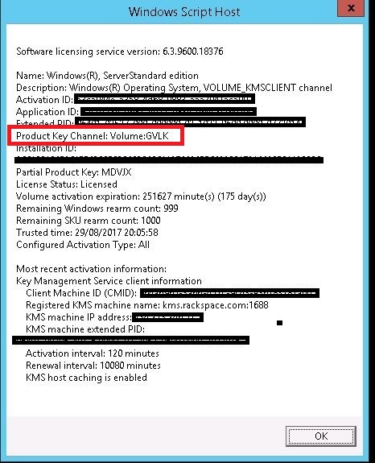
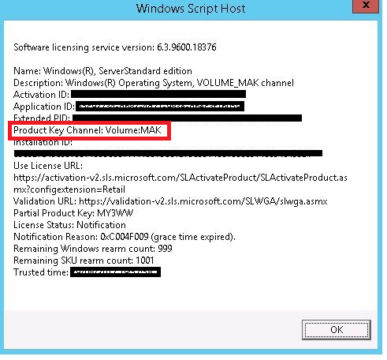

**Problem**: The Key Management Server (KMS) rejects periodic activation requests,
and the Windows&reg; operating system shows as unlicensed.

**Cause**: The two leading causes of this issue are:

  - Windows cannot locate the KMS.
  - The server's clock differs from the KMS clock by more than four hours.

Use the steps in the following sections to resolve this issue.

### Ensure that the Windows Server is configured to use the correct KMS server

Locate the appropriate KMS server in the following list:

<table>
     <tr>
       <th>Data center</th>
       <th>KMS server</th>
     </tr>
     <tr>
       <td>ORD (Chicago)</td>
       <td>winactivate.ord1.servers.rackspacecloud.com</td>
     </tr>
     <tr>
       <td>DFW (Dallas)</td>
       <td>winactivate.dfw1.servers.rackspacecloud.com</td>
     </tr>
     <tr>
       <td>IAD (Ashburn)</td>
       <td>winactivate.iad3.servers.rackspacecloud.com</td>
     </tr>
     <tr>
       <td>LON (London)</td>
       <td>winactivate.lon3.servers.rackspacecloud.com</td>
     </tr>
     <tr>
       <td>HKG (Hong Kong)</td>
       <td>winactivate.hkg1.servers.rackspacecloud.com</td>
     </tr>
     <tr>
       <td>SYD (Sydney)</td>
       <td>winactivate.syd2.servers.rackspacecloud.com</td>
     </tr>
</table>

1. Log in to your cloud server as administrator by clicking
   **Start > All Programs > Accessories**. Then, right-click **Command
   Prompt** and select **Run as Administrator**.

2. Confirm that you can ping the Rackspace KMS server by running the following command:

        ping kms-server-from-table-above

   **Note**: If there is a reply, continue to step 3. No reply means that there
   is an interface, hardware, or routing issue. We recommend the following
   article for help resolving the issue: [Update ServiceNet routes on cloud
   servers](/support/how-to/updating-servicenet-routes-on-cloud-servers/)

3. Set the KMS manually within the registry:

        slmgr.vbs /skms kms-server-from-table-above:1688

4. Request activation from the KMS:

        slmgr.vbs /ato

   **Note**: If you receive the error ``0xC004F074 The Key Management Server (KMS) is unavailable``,
   continue with the following steps to ensure the server clock synchronizes with the KMS clock.

5. If the device does not activate, the server might be set to MAK activation instead of KMS activation.

    To confirm the activation method set on the device, run the following command:

        slmgr -dlv

    Look for the **Product Key Channel** setting. **Volume:GVLK** means the device uses to **KMS activation**, **Volume:MAK** means the device uses to **MAK** activation.

    The following images show sample outputs:

    **KMS activation output**:

     

    **MAK activation output**:

     

6. If your device uses **MAK activation**, then you should set the device back to **KMS activation**.
    First, find and take note of the appropriate KMS client setup key from Microsoft&reg;: [KMS Client Setup Keys](https://technet.microsoft.com/library/jj612867.aspx)

    To find which server edition you are running, run the following command and look for the section labeled **OS name**:

        systeminfo | findstr OS

    Example:

        PS C:\Users\Administrator> systeminfo | findstr OS
        OS Name:                   Microsoft Windows Server 2012 R2 Datacenter

7. Set the device to **KMS activation** by using the key found in the  previously referenced article and entering the following command:

        slmgr /ipk %key%

    Replace **%key%** with the key from the Microsoft&reg; document.

8. To activate the device, run the below command:

        slmgr.vbs /ato

### Ensure that the server clock synchronizes with the KMS clock

If step 1 above returned the error `0xC004F074 The Key Management Server (KMS) is unavailable`, the time on the cloud server is drastically different than what is on the KMS.

1. At this point, you should configure the server to use a Network Time Protocol (NTP) time source by executing the appropriate command.

     <table>
     <tr>
       <th>Data center</th>
       <th>Command</th>
     </tr>
     <tr>
       <td>ORD (Chicago)</td>
       <td><code>net stop w32time w32tm /config /manualpeerlist:time.ord1.rackspace.com /syncfromflags:MANUAL net start          w32time</code></td>
     </tr>
     <tr>
       <td>DFW (Dallas)</td>
       <td><code>net stop w32time w32tm /config /manualpeerlist:time.dfw1.rackspace.com /syncfromflags:MANUAL  net start    w32time</code></td>
     </tr>
     <tr>
       <td>IAD (Ashburn)</td>
       <td><code>net stop w32time w32tm /config /manualpeerlist:time.iad3.rackspace.com /syncfromflags:MANUAL  net start    w32time</code></td>
     </tr>
     <tr>
       <td>LON (London)</td>
       <td><code>net stop w32time w32tm /config /manualpeerlist:time.lon3.rackspace.com /syncfromflags:MANUAL  net start    w32time</code></td>
     </tr>
     <tr>
       <td>HKG (Hong Kong)</td>
       <td><code>net stop w32time w32tm /config /manualpeerlist:time.hkg1.rackspace.com /syncfromflags:MANUAL  net start     w32time</code></td>
     </tr>
     <tr>
       <td>SYD (Sydney)</td>
       <td><code>net stop w32time w32tm /config /manualpeerlist:time.syd2.rackspace.com /syncfromflags:MANUAL  net start    w32time</code></td>
     </tr>
     </table>

2. After the time synchronizes, attempt each of the following commands:

        w32tm /resync

        slmgr.vbs /ato

3. You must open User Datagram Protocol (UDP) port 123 to allow the sync.

4. Make sure your firewall allows outbound connections to Transmission Control Protocol
(TCP) port 1688.
