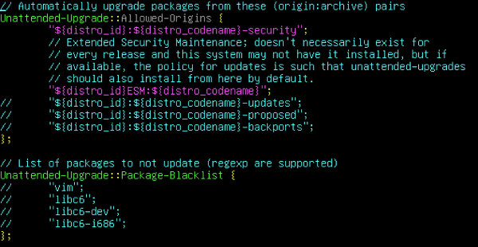
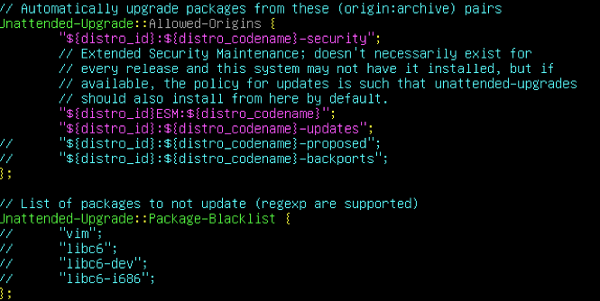

Keeping your servers up to date with security fixes helps you avoid server
compromises. While package updates can't prevent all security breaches,
applying updates to your servers should be a key component of your security
procedures.

This article describes how to enable automatic updates on your Debian&reg; and
Ubuntu&reg; 14.04 and 16.04 for Rackspace public Cloud Servers to ensure that
crucial updates are installed and current.

### Enable automatic updates

Use the following steps to enable automatic updates on your Debian and
Ubuntu 14.04 and 16.04 for Rackspace public Cloud Servers:

1. Connect to your Debian or Ubuntu 14.04 or 16.04 server.

2. Run the following command:

       sudo apt install unattended-upgrades

    The following image shows the output that the command generates:

    

3. Enter the following command to open the configuration file:

       vim /etc/apt/apt.conf.d/50unattended-upgrades

    The following image shows what the configuration file looks like:

    

    The lines that begin with two forward slashes (`//`) are comments that are
    ignored. The configuration options that appear on those lines are
    placeholders that are inactive.

4. In order to enable auto-updates, you need to uncomment the line of code
   that has the text `"${distro_id}:${distro_codename}-updates";`.

    Press the **i** key (for Insert mode) on your keyboard, and then press the
    down arrow to move the cursor to the forward slashes that appear to the
    left of `"${distro_id}:${distro_codename}-updates";`. Press the **del**
    key twice.

    The following image shows that the color of that line of code changes to
    indicate that it is now active, rather than a comment:

    

5. If you want to enable other configuration options, use the same steps to
   uncomment additional lines.

6. After you have made the changes that you want, press the **Esc** key (as
   shown in the following image), then type **:wq** and press **Enter** or
   **Return** to save the configuration file:

    

    A message stating that the file was properly written displays, as shown in
    the following image:

    

### Configure automatic updates

Use the following steps to configure automatic updates:

1. To set the recurring time for each of the updates, entering the following
   command to open the configuration file:

       vim /etc/apt/apt.conf.d/10periodic

2. Press the **i** key to enter Insert mode again.

3. Use the arrow keys to move to the line for the update that you want to
   change, then move to the number between the quotes. This number indicates
   the interval between updates, in days. Press the **del** key to delete it.

4. Enter the new number that you want to use for the update interval. The
   following example shows that three of the updates are performed daily,
   while the `AutocleanInterval` is every 14 days:

    

    When you're finished making changes, press the **Esc** key, then type
    **:wq** and press **Enter** or **Return** to save the configuration. A
    message stating that the file was properly written displays, as shown in
    the following image:

    

#### Configure notifications for automatic package updates (optional)

You can also choose to set up notifications for automatic package updates,
such as time of installation, packages installed, and errors that were
generated during the installation process.

Use the following steps to set up notifications:

1. From the command prompt, use the following command:

        sudo apt-get install apticron

2. Use the following command to configure the notifications:

       vim /etc/apt/apt.conf.d/50unattended-upgrades

3. Scroll to the line of code that has the text
   `//Unattended-Upgrade::Mail “root”;` and use the arrow keys to move to the
   forward slashes. Then press the **i** key and click **del** twice to remove
   the forward slashes.

    The color of the line changes to indicate that it is now active,
    rather than a comment.

4. Move to the right and press **del** to delete the word `root` inside of the
   quotes.

5. Between the same set of quotes, enter the email
   address that you want to use, as shown in the following image:

    

6. After you're finished making changes, press the **Esc** key, then type
   **:wq** and press **Enter** or **Return** to save the configuration.

    A message stating that the file was properly written displays, as shown in
    the following image:

    

7. Next, enter the following command:

       vim /etc/apticron/apticron.conf

8. Scroll to the line of code that begins with `EMAIL`. Press the **i** key,
   then move to the right and press the **del** key to delete the word `root`
   between the quotes.

9. Between the same set of quotation marks, enter the email address to which
   you want to send the notifications, as shown in the following image:

    

10. When you're finished making changes, press the **Esc** key, then type
    **:wq** and press **Enter** or **Return** to save the configuration.

     A message stating that the file was properly written displays, as shown
     in the following image:

     
