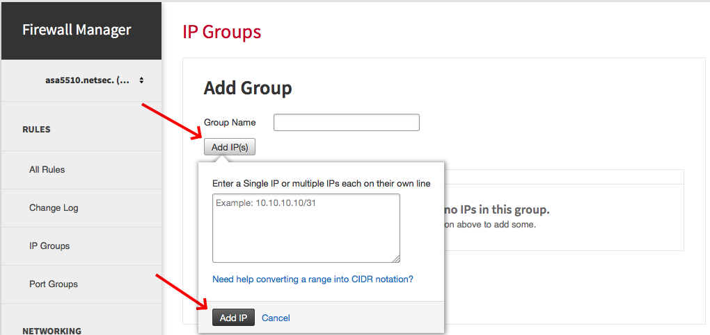

Firewall Manager v2 is a tool within the MyRackspace Portal. This article describes how to create object-groups within this tool, an easy to use feature that groups and sorts like items such as IP addresses, ports, or protocols.

To learn more about the tool, see [Firewall Manager v2](/support/how-to/firewall-manager-v2).

### Why should I use an object-group?

Object-groups improve the organization and readability of a firewall's running configuration. A running configuration that is easy to read and modify reduces the chances for a misconfiguration and increases the ability to troubleshoot issues quickly.

In Firewall Manager v2, object-groups are referred to as *IP groups*. You can view, create, modify, and delete any object-group on your firewall. For more information, see the following articles:

- [View an object-group](/support/how-to/view-an-object-group-with-firewall-manager-v2)
- [Modify an object-group](/support/how-to/modify-an-object-group-with-firewall-manager-v2)
- [Delete an object-group](/support/how-to/delete-an-object-group-with-firewall-manager-v2)

### Add an object-group

1. Log in to the [MyRackspace Portal](https://my.rackspace.com/portal/auth/login) by using your Rackspace account number, username, and password.

2. In the top navigation bar, click **Network** > **Firewall Manager v2**.

3. In the navigation pane on the left side of the panel, click the firewall for which you want to see object-groups.

4. Under **Rules** in the navigation pane, click **IP Groups**.

    

5. Under the **IP Groups** label, click **Add Group**. The **Add Group** page is displayed.

    

6. In the **Group Name** field, type the name of the object-group.

    We recommend using a name that directly relates to the access that this object-group will grant. We also recommend using all uppercase letters with dashes separating word groups. For example, if an object-group will be used to give John Doe SSH access to the web servers over Transmissiong Control Protocol (TCP) port 22, you might name the object-group `JOHNDOE-WEBSRVS-22`.

7. To add IP hosts or subnet ranges to the group, click **Add IP(s)**.

8. In the text field, type a single IP address or subnet, or enter a list of IP addresses or subnets, with each unique item on its own line.

    If you need help creating a custom subnet range, click the Classless Inter-Domain Routing (CIDR) link under the text field. The drop-down changes to an input range field. Define the IP range required and click **Convert IPs**. Firewall Manager v2 converts the IP range into the exact CIDR values required.

    **Note:** Firewall Manager v2 permits only `/24` to `/32` subnet sizes. If you require a subnet size larger than `/24`, contact Rackspace Support to manually add this value for you.

9. Click **Add IP**.

10. Click **Save Changes**.

Firewall Manager v2 interacts with your firewall and adds the configuration. This typically takes about 30 seconds, depending on the size of your firewall's configuration.

### Related articles

- [Firewall Manager v2 access-list theory and best practices](/support/how-to/firewall-manager-v2-access-list-theory-and-best-practices)
- [Firewall Manager v2 access-list rules](/support/how-to/firewall-manager-v2-access-list-rules)
- [Firewall Manager v2 port-objects](/support/how-to/firewall-manager-v2-port-groups)
- [Firewall Manager v2 change log](/support/how-to/firewall-manager-v2-change-log)
