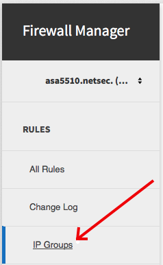
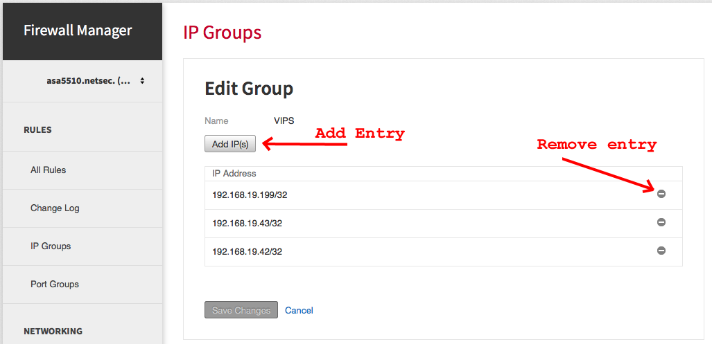

Firewall Manager v2 is a tool within the MyRackspace Portal. This article describes how to modify object-groups, an easy to use feature that groups and sorts like items such as IP addresses, ports, or protocols.

To learn more about the tool, see [Firewall Manager v2](/support/how-to/firewall-manager-v2).

### Why should I use an object-group?

Object-groups improve the organization and readability of a firewall's running configuration. A running configuration that is easy to read and modify reduces the chances for a misconfiguration and increases the ability to troubleshoot issues quickly.

In Firewall Manager v2, object-groups are referred to as *IP groups*. You can view, create, modify, and delete any object-group on your firewall. For more information, see the following articles:

- [View an object-group](/support/how-to/view-an-object-group-with-firewall-manager-v2)
- [Add an object-group](/support/how-to/create-an-object-group-with-firewall-manager-v2)
- [Delete an object-group](/support/how-to/delete-an-object-group-with-firewall-manager-v2)

### Modify an object-group

**Warning:** It’s important that you understand the impact of modifying an object-group. Incorrectly modifying an existing object-group that is already referenced in an access list has the potential to either create unwanted network access or remove critical access.

1. Log in to the [MyRackspace Portal](https://login.rackspace.com/) by using your username and password.

2. In the top navigation bar, click **Select a Product > Dedicated Hosting**.

3. Select **Network** > **Firewall Manager v2**.

4. In the navigation pane on the left side of the panel, click the firewall for which you want to see object-groups.

5. Under **Rules** in the navigation pane, click **IP Groups**.

    

6. Scroll through or search the object-group list and click the group that you want to modify.

7. Click **Edit Group**.

8. To add an entry, click **Add IP(s)** and add IP hosts or subnet ranges to the group. For instructions, see [Add an object-group](/support/how-to/create-an-object-group-with-firewall-manager-v2).

   

9. To remove an entry, click on the minus (-) symbol to the right of the object-group entry.

10. Click **Save Changes**.

Firewall Manager v2 interacts with your firewall and modifies the configuration. This typically takes about 30 seconds, depending on the size of your firewall's configuration.
