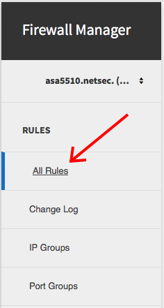

Firewall Manager v2 is a tool within the MyRackspace Portal that allows you to manage your Cisco firewall.

This article describes how to view access-list rules by using Firewall Manager v2.

To learn more about the tool, see [Firewall Manager v2](/support/how-to/firewall-manager-v2).

### Why use access-lists?

Access control lists (ACLs), or *access-lists*, enable Cisco firewalls to filter traffic. The security of your Rackspace environment begins at your Cisco firewall. Misconfigurations in network access policies on your firewall can lead to unwanted network exposure and potential compromise.

The access-lists control the traffic that attempts to enter the internal networks from an external, unsecured network. If access-lists are not used, the Cisco firewall's default security policy of _security-levels_ is active, which does not provide the highest level of network security.

An access control entry (ACE) is an individual entry in an ACL. ACEs are referred to as _rules_ in Firewall Manager v2. The Cisco firewall allows you to configure only one access-list per interface per direction. This access-list can contain as many ACEs, or rules, as necessary.

For more information about how to view, modify, add, and delete access-lists, see the following articles:

- [Add an access-list rule](/support/how-to/add-an-access-list-rule-with-firewall-manager-v2)
- [Modify an access-list's execution order](/support/how-to/modify-an-access-lists-execution-order-with-firewall-manager-v2)
- [Delete an access-list rule](/support/how-to/delete-an-access-list-rule-with-firewall-manager-v2)

### View access-list rules

1. Access Firewall Manager v2 by following the steps in the [Firewall Manager v2](/support/how-to/firewall-manager-v2) article.

2. In the navigation pane on the left side of the panel, click the firewall for which you want to see access-list rules.

3. Under **Rules**, click **All Rules**.

    

4. The **Rules** page shows the rules for the access-list on the selected tab. To view the rules for a different access-list, click that access-list's tab.

### Related articles

- [Firewall Manager v2 object-groups](/support/how-to/firewall-manager-v2-object-groups)

   - [View an object-group](/support/how-to/view-an-object-group-with-firewall-manager-v2)
   - [Create an object-group](/support/how-to/create-an-object-group-with-firewall-manager-v2)
   - [Modify an object-group](/support/how-to/modify-an-object-group-with-firewall-manager-v2)
   - [Delete an object-group](/support/how-to/delete-an-object-group-with-firewall-manager-v2)

- [Firewall Manager v2 port-objects](/support/how-to/firewall-manager-v2-port-groups)
- [Firewall Manager v2 change log](/support/how-to/firewall-manager-v2-change-log)
- [Firewall Manager v2 access-list theory and best practices](/support/how-to/firewall-manager-v2-access-list-theory-and-best-practices)
