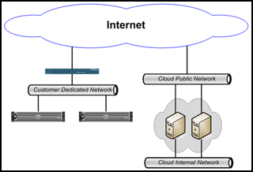
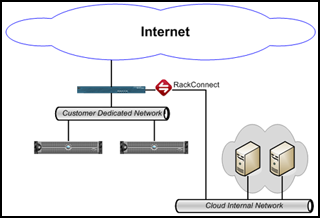

**Previous section:** [RackConnect key terms](/support/how-to/rackconnect-key-terms)

**Applies to:** RackConnect v2.0

The following items are required to implement RackConnect v2.0.

### Supported network device

The RackConnect automation is compatible with any Cisco ASA firewall
(5505 Security+ or better) or F5 BIG-IP load balancer. To implement
RackConnect, you need at least one of these devices in your managed
hosting configuration. If you already have one, there is no additional
charge for RackConnect.

### Supported region

RackConnect is currently available in our Chicago (ORD), Dallas (DFW),
Virginia (IAD), Sydney (SYD), Hong Kong (HKG), and London (LON3)
regions. To implement RackConnect, your dedicated managed hosting
environment and cloud environment must be located in the same region.

### Automation process

RackConnect connects an available physical interface on your network
device to the cloud internal network. Creating a new cloud server
triggers the RackConnect automation process, which, in cases where all
automation features are enabled, performs the following actions:

1.  Validates the existence of a gateway IP address on your RackConnect
    connected device, and adds the appropriate gateway IP address if one
    does not exist

2.  Provisions a public IP address for the cloud server and configures a
    static NAT translation for it on the RackConnect edge network device

3.  Connects to the cloud server, disables its public interface, and
    routes all traffic through its private interface (ServiceNet, which
    has the 10.x.x.x IP address) towards your RackConnect connected
    device as the default gateway

4.  Adjusts access lists on the firewall, load balancer (if applicable),
    and cloud server software firewalls based on your predefined network
    policies

**Without RackConnect**, traffic is routed out through the Internet when
connecting from Dedicated to Cloud.

**With RackConnect**, traffic is routed via your dedicated network
device to the cloud. RackConnect automation keeps your dedicated
configuration and cloud servers secure.

### Next step

[Getting RackConnect support](/support/how-to/getting-rackconnect-support)
