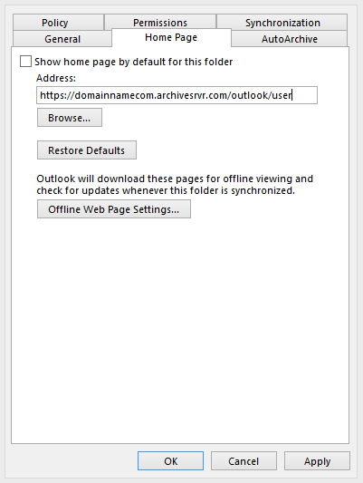

This article describes how to create a folder in Microsoft Outlook that connects to your
archived mail.

**Warning:** This feature can no longer be configured in Outlook 2016.

1. Copy the URL of your archive login. It should look similar to the following URL:

   `https://domainnamecom.archivesrvr.com/login/new`

    **Note:** You must log out of the **Archive Manager** first, and then
    copy the URL from your web browser.

2. Replace `/login/new` with `/outlook/user`.

3. Log in to Microsoft Outlook.

4. In Outlook, create a new folder by right-clicking **Inbox** and selecting **Create New Folder**.

5. Edit the name of your new folder by right-clicking **New Folder** and selecting **Properties**. You can choose any folder name that you want.

6. Integrate the new Outlook folder with your personal archive, as follows:

   a.  Right-click the newly created folder and select **Properties**.

   b.  Click the **Home Page** tab, and paste in the URL that you copied in step 1 and altered in step 2.

   c.  Click **OK**.

   

7. Open your newly integrated Microsoft Outlook folder. You should now be directly connected to your personal archive.
