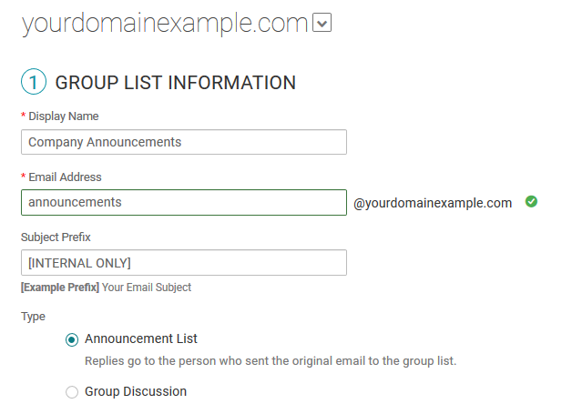
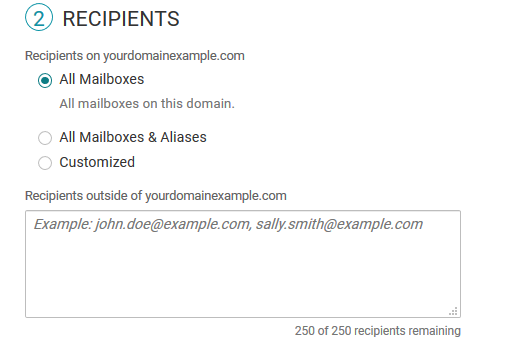
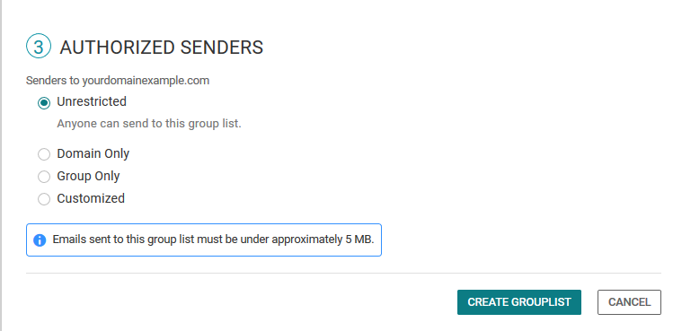

This article shows how to create a group list.

### Prerequisites

- **Applies to:** Administrator
- **Difficulty:** Easy
- **Time needed:** 5 minutes
- **Tools required:** Cloud Office Control Panel access

For more information on prerequisite terminology, see [Cloud Office support terminology](/support/how-to/cloud-office-support-terminology).

A group list is a great way to manage users in a select team or group on your domain. There is no limit to the number of internal address recipients (addresses within your domain) and a limit of 250 additional recipients outside of the internal domain. For example, suppose that you have a billing team you want to group together - bob@domain.com, amy@domain.com, and scott@domain.com. You can create a group list for the team so that they can communicate new upcoming billing updates within the team, at billingupdates@domain.com.

**Note:** Grouplists are restricted to a maximum message size of 5 MB.

1. Log in to the [Cloud Office Control Panel](https://cp.rackspace.com).
2. In the Rackspace Email section, click **Group Lists**.

    

3. On the Group Lists page, click **Add Group List**.

    

4. Enter in an email address for your group list, enter a subject tag, and select a list type. You can choose to send replies to the sender only or send replies to the entire group list.

    

5. Select the recipients to include in the group list. You can add recipients outside your domain.

    

6. Select who will be authorized to send email to this group list.

    

7. Click **Save**.
