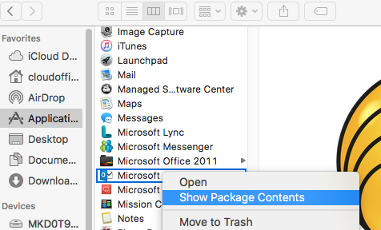
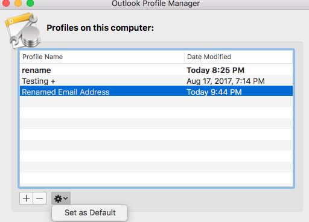
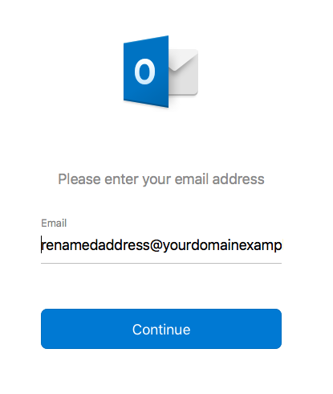
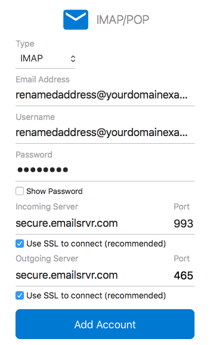

After you have renamed a Rackspace Email address, your devices such as desktop computers, laptops, and mobile phones receive new email only after you configure them to connect to the new email address. This article describes how to configure a renamed email address in Outlook 2016 for Mac.

### Prerequisites

- **Applies to:** User
- **Difficulty:** Easy
- **Time needed:** Approximately 20 minutes
- **Tools required:**  Mailbox password and access to the devices that you want to connect

For more information about prerequisite terminology, see [Cloud Office support terminology](/support/how-to/cloud-office-support-terminology/).

**Warning:** If the old email address connects via POP, you must migrate the POP data to an IMAP account so that no data is lost in the rename configuration. Follow the instructions in [Migrate from a POP server to IMAP in Outlook for Mac](/support/how-to/migrating-from-a-pop-server-to-rackspace-email-imap-using-outlook-2011-mac/), before continuing with the instructions for Outlook for 2016 Mac.

#### Configure mail settings

1. Quit Outlook 2016 by right-clicking the icon and selecting **Quit**.
2. Open **Finder** and select **Applications**.
3. Highlight **Outlook 2016** in the application menu, and right-click the icon.
4. Click **Show Package Contents**.

    

5. Click the **Contents** folder, and then click the **SharedSupport** folder.

    

6. Open **Outlook Profile Manager** to view the list of existing profiles. Click the **+** sign to add a new profile, and name the new profile. Highlight the new profile, click the gear icon, and select **Set as Default**.

    

7. Close **Outlook Profile Manager**, and open **Outlook 2016** so that you can set up your email in the new profile.

8. When prompted, enter the renamed email address, and click **Continue**.

    

    Note: If Outlook 2016 defaults to selecting Exchange as the account type, select **Not Exchange?** in the upper-right corner.

9. Select **IMAP/POP**, and enter the following details:

    - **Type:** IMAP
    - **Email address:** The new mailbox address
    - **Username:** The new mailbox address
    - **Password:** The mailbox password
    - Incoming Server settings:
      - **Incoming Server:** secure.emailsrvr.com
      - **Port:** 993
      - **Use SSL to connect:** Selected
    - Outgoing Server settings:
      - **Outgoing Server:** secure.emailsrvr.com
      - **Port:** 465
      - **Use SSL to connect:** Selected

    

10. Click **Add Account**, and click **Done**.

You have now successfully configured Outlook 2016 to connect to the renamed email address.

**Note:** If you notice items missing in the new Outlook account, import the data from the old profile. See [Migrate from a POP server to Rackspace Email IMAP](/support/how-to/migrating-from-a-pop-server-to-rackspace-email-imap-using-outlook-2011-mac/).
