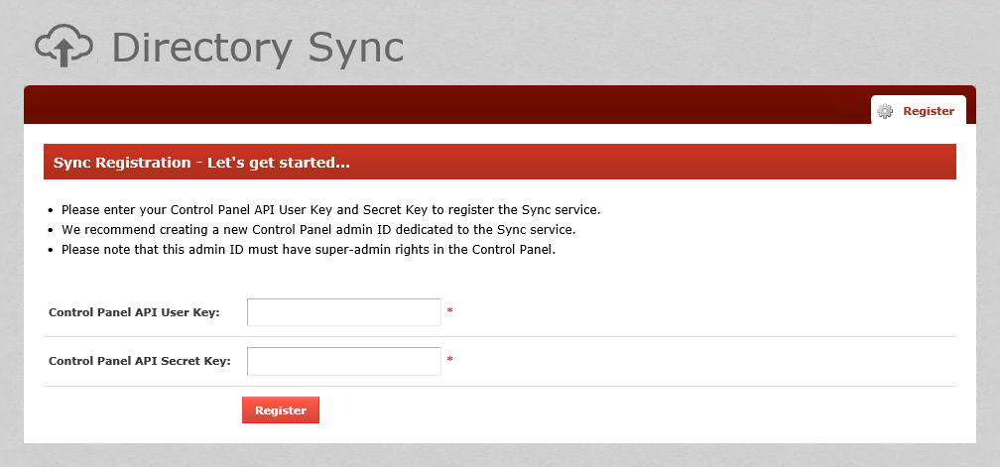
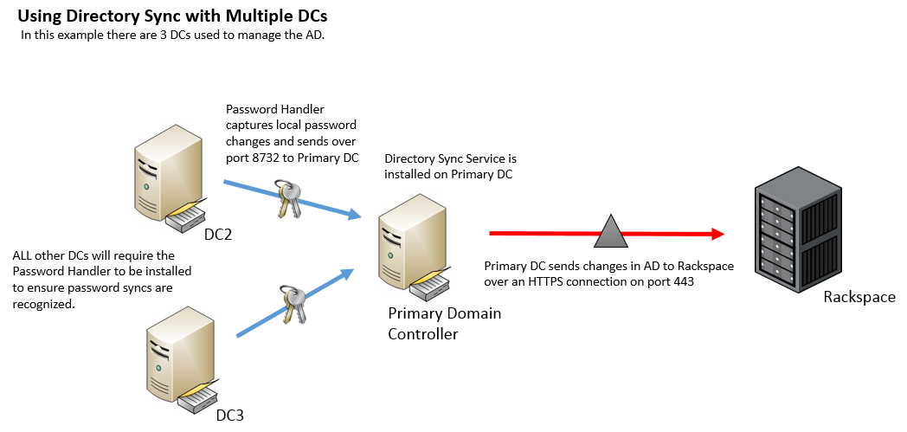
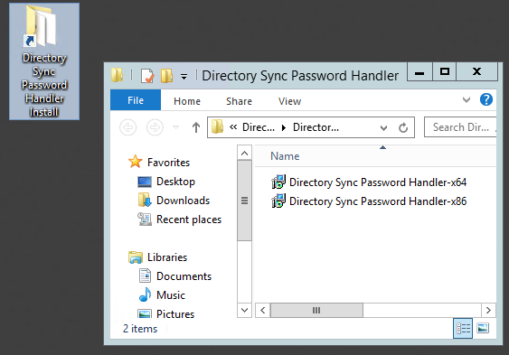

Rackspace Directory Sync enables Rackspace Hosted Email customers to
synchronize their local Microsoft&reg; Active Directory objects and user
passwords with Rackspace Hosted Email in real time. This article describes
how to install and configure Rackspace Directory Sync.

### System requirements

A functional level of domain controller (DC) and Active Directory such as:

- Windows&reg; Server 2008
- Windows Server 2008 R2
- Windows Server 2012 R1 & R2

#### Important notes

- The Directory Sync service must be installed *directly* on your
    domain controller.
- After installation, Directory Sync *cannot* automatically
    synchronize existing passwords because they are unreadable from the
    Active Directory. Passwords *must be reset* after installation to
    ensure password synchronization.
- Directory Sync is compatible only with Hosted Exchange 2010, Hosted
    Exchange 2013, Hosted Exchange 2016, and Rackspace Email.

#### Software prerequisites

You must have Microsoft .NET Framework version 4.0 on the target DC
and any other DCs in the system. You can download the
appropriate .NET Framework from the [Microsoft Download
Center](https://www.microsoft.com/download/en/details.aspx?id=17718).

#### Firewall ports

You do not have to open any inbound ports from the Internet to your
DCs.

Enable the following ports on the Directory Sync server:

- **443** - Outbound HTTPS connections from the Directory Sync service
    to the Rackspace API.
- **8732** - Open for connections from other DCs to the
    Directory Sync server, but not used for any connections outside
    your network. This port is used by DC password
    hooks.
- **8080** - Used only locally on the Directory Sync service server
    for a web browser user interface. You can block this port for any
    external connections.

#### Network encryption

Communication between Directory Sync and Rackspace is secured through
HTTPS. Communications between the Active Directory password hook and
Directory Sync are secured with Microsoft Windows Communication
Foundation (WCF) transport security, which uses Windows authentication
and encryption.

#### Installation files

You can find the installation files while logged in to
either the [Cloud Office Control Panel](https://cp.rackspace.com) or the
[MyRackspace Portal](https://login.rackspace.com), depending on how you
normally log in.

Administrators who log in to the MyRackspace Portal as
the primary contact can use the following steps:

1. In the top navigation bar, click **Select a Product > Dedicated Hosting**.
2. Click **Products > Cloud Office**.
3. Click on your domain. The Directory Sync installers are located in the right column.

Administrators who log in to the Cloud Office Control Panel with
Super Admin permission can use the following steps:

1. While on the home page, click **Domains**.
2. On the Domains Home page, click on **Tools**, and then click
   the **Directory Sync** tab.

   The Directory Sync installers are listed at the bottom of the page.

Choose the appropriate installer, based on either 32- or 64-bit platforms.

- **Directory Sync Service x64.msi**
- **Directory Sync Service x86.msi**

#### Administrator's guide

To learn more about the features of the Directory Sync and how to use it
after installation, see the [Rackspace Directory Sync: Administrator's
Guide](/support/how-to/rackspace-directory-sync-administrators-guide).

### Install the Directory Sync service

Two services are installed with the Directory Sync system, the Directory
Sync service and the Password Handler service. The Directory Sync
service is a Windows service that automatically synchronizes user
information and requires a local service account under which to run. The
Password Handler service automatically synchronizes user password changes.

**Note:** The Directory Sync service runs as the Local System account on
the DC.

1. Copy the appropriate platform-specific Directory Sync
   service **.msi** file to the domain controller.

2. Open the file and follow the prompts for installing the Directory
   Sync service.

**Note**: When prompted, click **Yes** to restart your system now or
click **No** to manually restart it later. You must restart for the changes
to take effect. If you restart now, the installation wizard continues.

When the installation is complete, the web UI for validation and synchronization
automatically opens. A shortcut to the web UI is created on both the Start
menu and on the desktop.

### Configure the Directory Sync service and synchronize

The Windows Services management console contains a new service called
Directory Sync. The installation automatically starts the service. If
any errors occur when the service is starting, view the event log for
more information about the error.

**Note:** We recommend creating new security groups in Active Directory
that manage the list of synchronized users for each hosted service.
For example, if you are synchronizing Exchange users, create a new
security group in Active Directory as Rackspace Exchange or Rackspace
Hosted Exchange.

To start synchronizing Active Directory changes with Rackspace, configure the
Directory Sync by performing the following steps:

1. Open the Directory Sync service administrative web application, if
    it is not already open:

    

2. On the Sync Registration Page, enter the API User Key
    associated with your Rackspace Cloud Office account, and then click
    **Register**.
    - Customers who logged in to the [MyRackspace Portal](https://login.rackspace.com)
        will automatically create an admin ID through the MyRackspace
        Portal before download.
    - Customers who logged in to the [Cloud Office Control Panel](https://cp.rackspace.com)
        should create a new admin ID dedicated to the
        sync service.

3. On the **Settings** tab, provide the following information:

    - **Local AD domain**: Verify that the appropriate local Active
        Directory domain is selected.
    - **Hosted Exchange**: Select the appropriate security group to be
        synchronized with Microsoft Exchange mailboxes.
    - **Hosted Email**: Select the appropriate security group to be
        synchronized with Rackspace Email mailboxes.

    **Note:** The daily admin summary emails are no longer a feature of the Directory Sync service. You can now find this information on the sync history and alerts tab in the Directory Sync UI.

4.  Click **Save & Start Sync** to begin a full synchronization.

    There are two types of synchronization:

    -   **Full synchronization** finds all items available for
        synchronization in the entire directory. This synchronization
        type initiates only on the first synchronization process.
    -   **Delta synchronization** finds changes available for
        synchronization in Active Directory that occurred since the
        last synchronization. This synchronization type runs
        automatically every 5 minutes by default but can also be
        performed manually. To manually run a delta synchronization,
        click the **Sync History** tab and then click the **Sync Now** button.

**Note:** The Directory Sync services never make changes to the
directory. All access is read-only.

### Synchronize users and groups

For information about how to start synchronizing your Active Directory
objects to your mailboxes and distribution lists, see the [Rackspace Directory
Sync Operations
Guide](/support/how-to/rackspace-directory-sync-operation-guide).

### Install password synchronization for multiple DCs (optional)

The main installer for Directory Sync is installed on one DC that communicates
directly to Rackspace. The DC
communicates through the Rackspace API to the Cloud Office Control Panel
over an HTTPS connection on port 443. This DC, or primary DC, includes
the Directory Sync UI and is where Directory Sync is configured.

If you have multiple DCs to manage the Active Directory, you must
install the Password Handler on all DCs except the primary DC (the
Password Handler is installed during the initial setup). Normally, password
changes in a network occur locally and then are replicated to the other
DCs. Directory Sync is unable to see those password changes after
replication because of encryption. To ensure that password changes are
synchronized, each DC requires the Password Handler to be installed
directly. This installation requires each DC to restart.

Password changes made in the other DCs are delivered to the primary DC
over port 8732. Multiple DCs communicate internally with the primary DC
and do not send any password changes outside of the network. All
password synchronizations are funneled through the primary DC and then
synchronized to Rackspace.

The following figure illustrates this communication process.

#### Install the Password Handler service on secondary domain DCs

During the installation of the Directory Sync service on the primary DC,
the **Directory Sync Password Handler Install** folder was created on
the desktop. Use the installer in this folder to synchronize your users'
passwords across multiple DCs.

**Note:** The **.msi** file within the folder should be installed only on the
secondary DCs.

This process applies to multiple DCs (two or more).
Repeat the following steps for each additional DC in the
Active Directory forest.

**Important:** You must restart each DC to complete this
process. Consider performing these steps during off-hours.

1. Copy the **.msi** file to the secondary DC.
2. Double-click the installation file and click **Next** on the welcome page of the wizard.
3. On the next page, click **Install**.
4. After the restart, click **Finish**.

The Password Handler of Directory Sync is installed.

**Note:** This application runs in the background. You do not have to
configure any settings. Settings are taken from the primary DC.

Now that the installation is complete, see the [Rackspace Directory Sync Administrator's Guide](/support/how-to/rackspace-directory-sync-administrators-guide) and the [Directory Sync Operations Guide](/support/how-to/rackspace-directory-sync-operation-guide) to learn how to use Directory Sync and its features.
