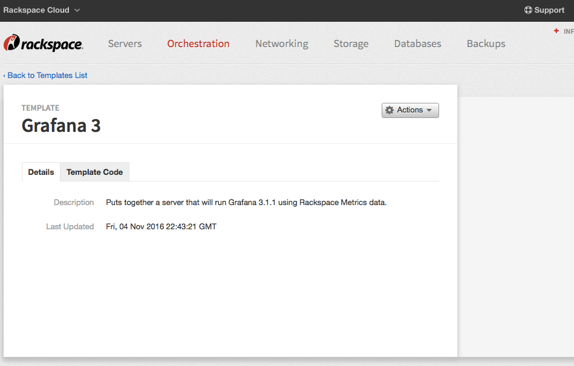
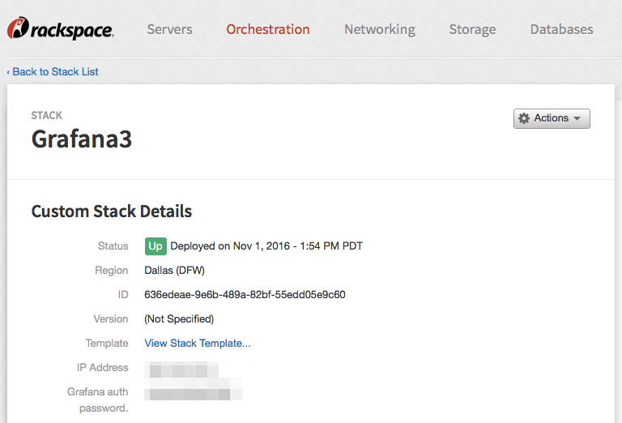
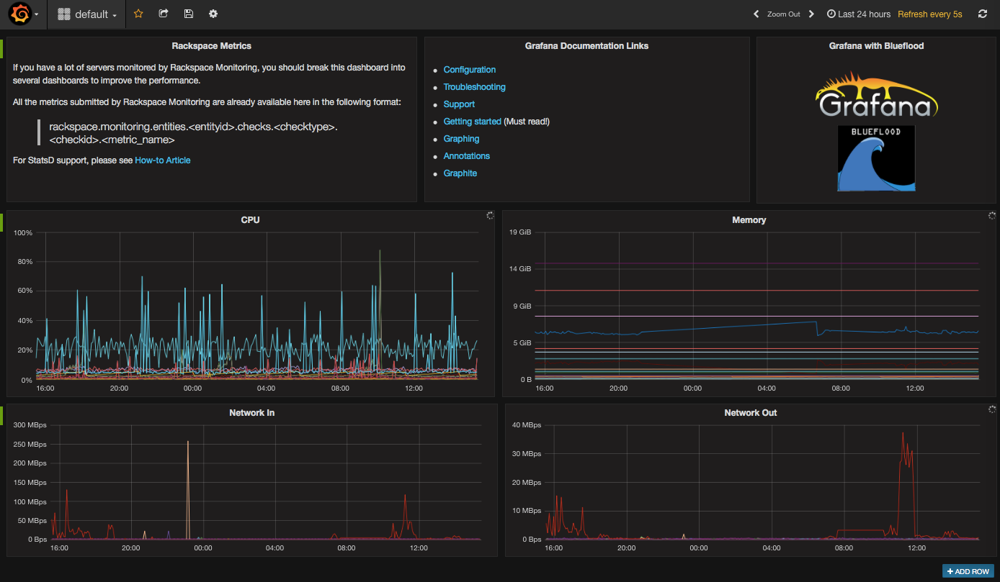
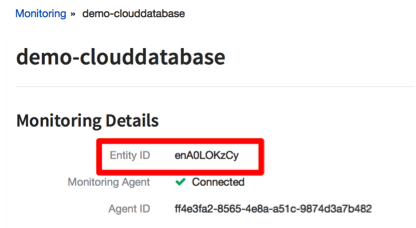
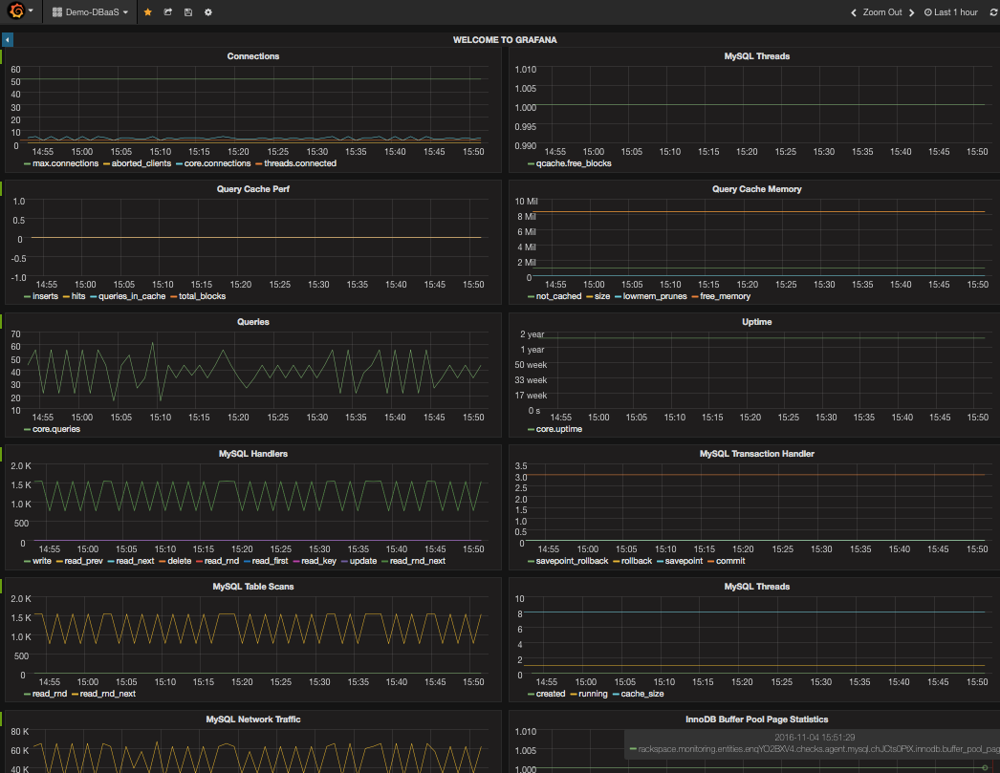

Rackspace Metrics lets you build a Grafana&reg; dashboard to visualize your
metrics. Instead of using a stand-alone Graphite back end, you can point
your Grafana instance to the Rackspace Metrics service. You can complete
all of these steps directly from the Rackspace Cloud Control Panel by
importing a custom template, and then creating a stack from this template.

This article describes how to deploy a Grafana instance for Rackspace
Metrics by using a custom Cloud Orchestration template. It also provides
instructions about how to upload a Grafana dashboard for a database
instance.

If you prefer to deploy Grafana without the custom Cloud Orchestration
template or upgrade your existing Grafana instance, see [Grafana 3.0 with
Blueflood
datasource](https://github.com/rackerlabs/blueflood/wiki/Grafana-3.0-with-Blueflood-datasource).

### Deploy the Grafana instance for Rackspace Metrics

To create a Grafana dashboard, complete the following steps:

1.  Log in to the [Cloud Control
    Panel](https://login.rackspace.com/) with
    your username and password.
2.  In the top navigation bar, click **Select a Product > Rackspace Cloud**.
3.  Click **Orchestration > Stack Templates**, and then click **Create Custom Template**.
4.  Go to <https://bitly.com/heat-grafana> and copy the content on
    the page. This is the template that you use to create
    your stack.
5.  Return to the Cloud Control Panel.
6.  On the **Create Custom Template** page, perform the following steps:

     - Enter a name for the template.
     - Paste the template content that you just copied.
     - Click **Validate Syntax** at the bottom of the page.

        After the template is successfully validated, an `It works!` message
        displays beside the button.

7.  Click **Create Template**.

     Your template is created. This process might take a few minutes.
     After the template is complete, a details page displays that shows
     information about your custom template, as shown in the following image:

     

8.  From the **Actions** menu, select **Create Stack from Template**.
9.  On the **Create Stack** page, enter a name for the stack and then
    enter values for the following fields under **Server Settings**. Use
    the values for your Rackspace account, and overwrite the **not valid**
    values that are populated by default:
    -   **API key**
    -   **username**
    -   **tenant ID** (your account number)

10. Click **Create Stack**.
     The stack details page displays.
     While the stack is being built, the **Status** is **Building**.

When the stack is finished building, the **Status** field changes to
**Up**. The page also displays an IP address, a Grafana authentication
password, and a Grafana authentication username that you can use to access
your Grafana dashboard. Ensure that you record this information.

### Use the Grafana dashboard

After you create your stack, you can access the Grafana dashboard, which provides all of the relevant information about your stack.

To access the Grafana dashboard, perform the following steps:

1.  Open a web browser.

2.  Type the IP address in the address bar.

    You are prompted to authenticate.

3.  Enter the username and password that displayed after you created
    the stack and click **Log In**.

4.  Create your Grafana dashboard from Rackspace Monitoring data by pasting
    the JSON code found in the [Rackspace Cloud Orchestration template for
    Grafana](https://github.com/rackspace-orchestration-templates/grafana/blob/master/dashboards/default_dashboard.json).

     

All of the metrics that Rackspace Monitoring submits display in the following
format:

`rackspace.monitoring.entities.<entityid>.checks.<checktype>.<checkid>.<metricname>`

This example URL shows that Rackspace Monitoring generates an `entity ID`
and a `check ID` to guarantee the uniqueness of the metrics. You can use the
`entity ID` and `check ID` to identify the format of the metric that you
want to see.

You can locate the entity ID and check ID in the [Cloud Control
Panel](https://login.rackspace.com/) on the Rackspace Intelligence
**Monitoring Details** and **Check Details** pages.

For more information, see the following articles:

- [Getting Started with Rackspace Intelligence for the cloud](/support/how-to/getting-started-with-rackspace-intelligence-for-the-cloud)

- [Monitor entities with Rackspace Intelligence](/support/how-to/monitoring-entities-with-rackspace-intelligence)

- [Working with checks](/support/how-to/working-with-checks)

The following screenshot shows where you can locate the entity ID on
the **Monitoring Details** page:

You can also locate the monitoring and check IDs by looking at the
Rackspace Intelligence URL for a particular check. The following link provides
an example of this URL:

[https://intelligence.rackspace.com/cloud/entities/enrmO7n1hX/checks/ch6fvLIaMC](https://intelligence.rackspace.com/cloud/entities/enrmO7n1hX/checks/ch6fvLIaMC)

The entity ID directly follows the `entities` parameter. Entity IDs always
start with the letters *en*. The check ID directly follows
the `checks` parameter. Check IDs always start with the letters *ch*.

#### Upload a Grafana dashboard for database instances

Rackspace has created a Grafana dashboard to help you set up your Cloud
Databases MySQL&reg; instances.

To upload a Grafana dashboard that shows your MySQL instances,
complete the following steps:

1.  Download the [Grafana dashboard JSON file](https://bit.ly/mysql-grafana).
2.  Modify the JSON code to match your instance by replacing all of the
    instances of `\_rax\_entity\_id\_` in the file with the entity ID of
    your database instance, as shown in the following image:

     

3.  On the Grafana dashboard, click the folder icon in the top-right corner,
    click **Import > Choose File**, and then upload the file to Grafana.

     The dashboard automatically appears and displays your MySQL database
     instances, as shown in the following image:

    

#### Use annotation (optional)

Annotation support enables you to submit change events to show along with the
graph. Taking this step adds information to the graph on the dashboard. For
more information, see [Use annotation metrics](/support/how-to/use-annotation-metrics).

### Grafana FAQ

The following FAQ provides more information about using Grafana.

#### How much does Grafana cost?

You pay only for the cost of the server that you create.

Grafana is an open-source metrics dashboard and graph editor. There is
no cost for the software itself. You can choose to deploy it anywhere, and
you are responsible only for maintaining and paying for the server that it
runs on.

We want you to have access to your metrics so that you can make informed
decisions about your infrastructure. Our monitoring service and metrics
storage are available at no cost.

#### Should I use Rackspace Intelligence or Grafana?

Rackspace Intelligence is a no-cost option that we provide to help you make
your infrastructure choices. It is designed to answer basic questions about
your servers. Rackspace Intelligence covers many use cases and offers limited
customization options. For full customization, you might want to use Grafana.

Also consider that Rackspace Intelligence does more than display graphs. It is
a control panel that enables you to manage your Rackspace Monitoring configuration. Although Grafana might give you total control
over your graphs, Rackspace Intelligence gives you total control over
creating, deleting, and editing your monitoring configuration.

Rackspace Intelligence and Grafana use the same metrics that are stored in
the Rackspace Metrics service. As a result, you can try both services and
choose the one that works well for you. For more information,
see [Getting started with Rackspace Intelligence for the
cloud](/support/how-to/getting-started-with-rackspace-intelligence-for-the-cloud).
