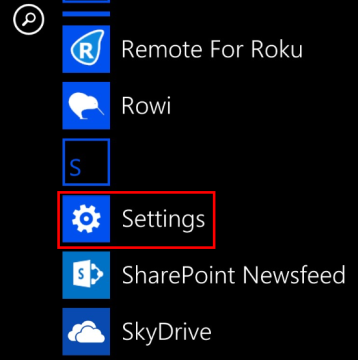
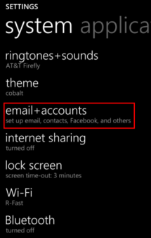
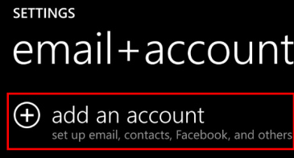
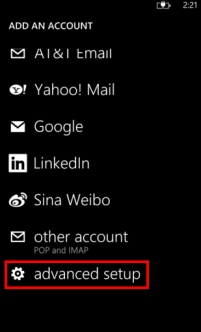
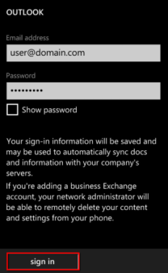
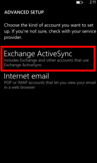

ActiveSync devices are unique, based on device and provider. You will
need the information provided in the User Control Panel to set up
Exchange on an ActiveSync device.

1. Log into your [User Control Panel](https://admin.emailsrvr.com/usercp).

2. In the **Client Setup** section, click the **ActiveSync** link.
   This opens the **Setting Up ActiveSync** window.
   You will need the information displayed in the **Setting Up ActiveSync**
   window to set up the account.

3. Locate the **Settings** options from within your
   application menu.

   

4. Select **Email + Accounts**.

   

5. Select **Add an Account**.

   

6. Select the option for **Advanced Setup**.

   

7. Enter your full email address and the password for your account, then
   press the **sign in** button.

   

8. Select **Exchange ActiveSync**.

   

9. The Exchange setup screen will open. Enter the following
   information:

   - Username - Enter the **User name** exactly as it is from the
     **Setting Up ActiveSync** window. The **User name** is different
     from the email address.

   - Domain - Enter the **Domain address** exactly as it is from the
     **Setting Up ActiveSync** window.

   - Server - Enter the **Server address** exactly as it is from the
     **Setting Up ActiveSync** window.

   - Account Name - Enter a descriptive name for your account (for example, My
     Work Account). This description will be visible only to you.

   ![](windowssetupnewstep.jpg" width="200" height="333" />

10. Select the **sign in** button. Once connected, you will see a new
    icon within your settings menu with the name of your new email account.
