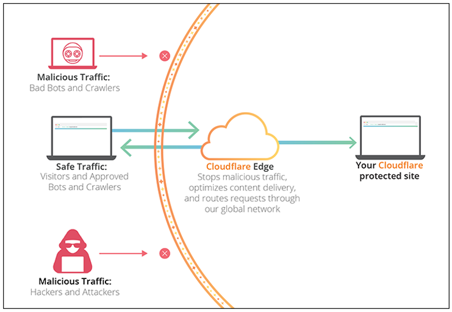

More than just Content Delivery (CDN) services, customers rely on the
Cloudflare&reg; global network to enhance security, performance, and reliability of anything
connected to the Internet. Cloudflare doesn't require additional hardware,
software, or changes to your code.

The following graphic illustrates how Cloudflare works to protect your
site against malicious traffic:

### Security

Cloudflare stops malicious traffic before it reaches your origin web server.
Cloudflare analyzes potential threats in visitor requests based on
several characteristics:

- Visitor's IP address
- Requested resources
- Requested payload and frequency
- Customer-defined firewall rules

A Domain Name Service (DNS) lookup or `ping` of a proxied Cloudflare subdomain returns the Cloudflare IP
addresses. Cloudflare masks your origin IP address for proxied (orange-clouded) DNS records so attackers cannot bypass Cloudflare and directly attack your origin web server.

### Performance

Cloudflare optimizes the delivery of website resources for your visitors.
Cloudflare's data centers server your website's static resources and ask
your origin web server for dynamic content. Cloudflare's global network
provides a faster route from your site visitors to our data centers than
would be available to a visitor directly requesting your site. Even with
Cloudflare between your website and your visitors, resource requests arrive
at your visitor sooner.

### Reliability

Cloudflare's globally-distributed anycast network routes visitor requests to
the nearest Cloudflare data center. Cloudflare-distributed DNS responds to
website visitors with Cloudflare IP addresses for traffic that you proxy to
Cloudflare. This distribution also provides security by hiding the specific IP address
of your origin web server.

Cloudflare-proxied domains share IP addresses from a pool that belongs to the
Cloudflare network. As a result, Cloudflare does not offer dedicated or
exclusive IP addresses.
