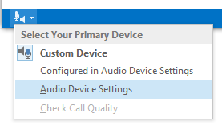
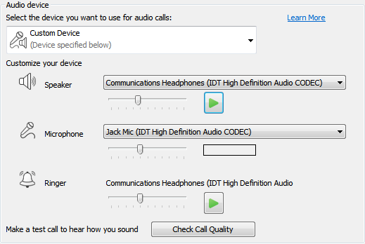

When you use Hosted Skype&reg; for Business at Rackspace, you can make and
answer audio calls through the application, as described in the following sections:

-   [Set up your audio device](#set-up-your-audio-device)
-   [Make an audio call](#make-an-audio-call)
-   [Answer an audio call](#answer-an-audio-call)

### Set up your audio device

You must set up your audio device and test your audio device before using Skype for Business to make or join an audio call. You can use compatible audio devices such as a microphone and speakers, or you can use a headset or earphones.

1.  In the lower-left corner of the Skype for Business main window,
    click the **Select Your Primary Device** icon, and select **Audio
    Device Settings** from the menu.

    

2.  Click **Select the device you want to use for audio calls**, and select the device that you want to use.

3.  In the **Customize your device** section, drag the sliders to adjust
    the volumes for the speakers and microphone.

    -   To hear a sample tone, click the green arrow for the speaker.
    -   Adjust and test your microphone by using the blue indicator to
        choose the appropriate level. If you are using a handset, speak into the receiver. If you are using a headset,
        speak into the microphone.

        

### Make an audio call

In your contact list, hover your mouse pointer over the picture of the
person you want to call, and then click the **Phone** icon. 

![](audio1a.jpg" alt="" />

### Answer an audio call

When you receive a call, the following notification appears on your screen:

![](Audio2.JPG" width="170" height="204" />

You can perform any of the following actions:

-   To answer the call, click in the photo area of the notification.
-   To reject the call, click **Ignore**.
-   Click **Options** to perform one of the following other actions:
    -   Reply by instant message instead of audio.
    -   To reject the call and avoid other calls, select **Set to** **Do
        Not Disturb**.
